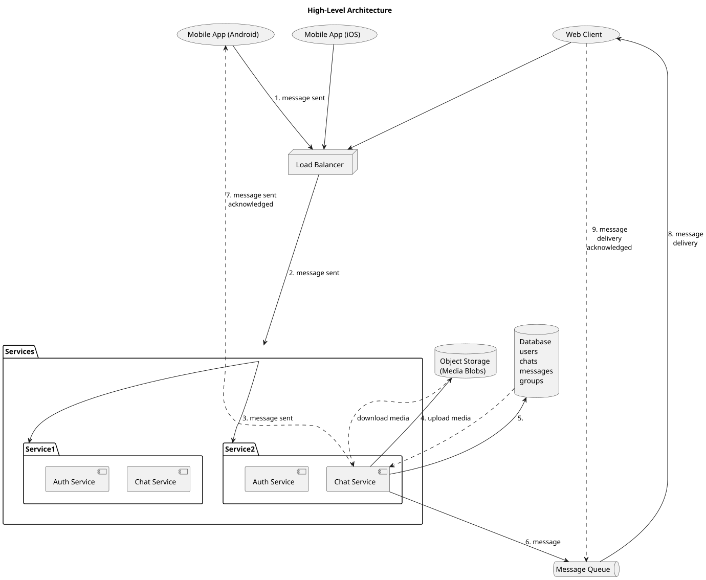
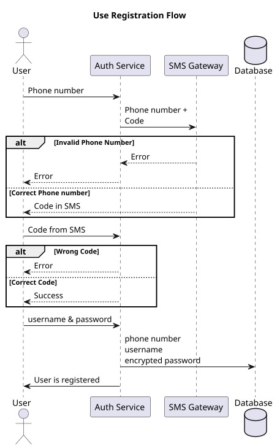
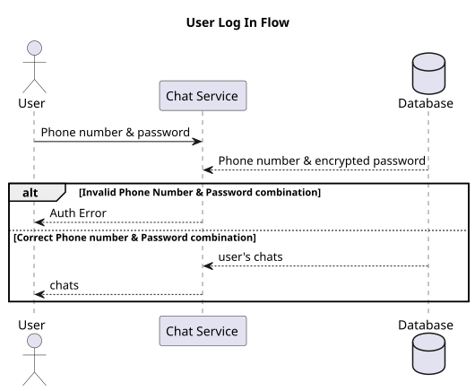
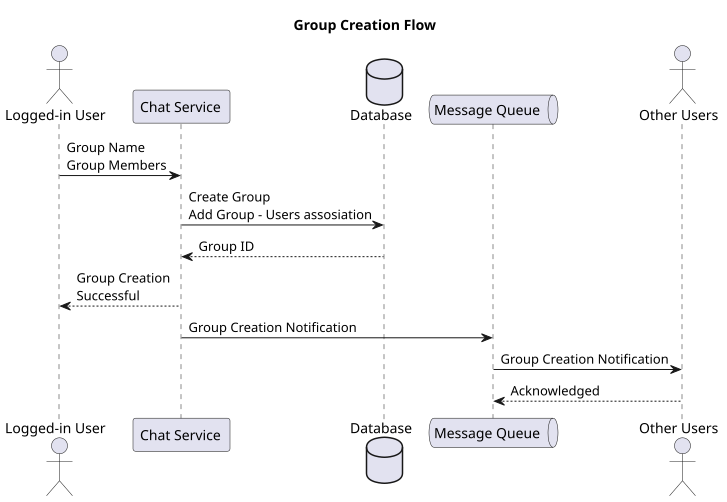
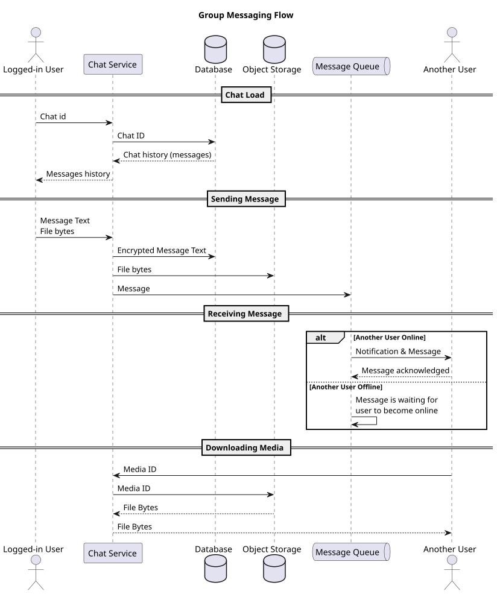
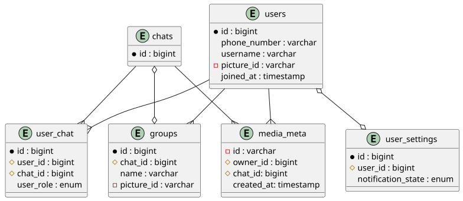
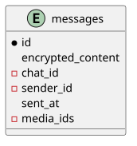
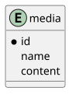

# Chat/Messaging Platform

## Purpose
This document defines the architecture of a WhatsApp-like messaging platform, including requirements, use-cases, data design, major components, their responsibilities, and the interactions between them. Also, the document covers solutions for high scale and security challenges.

## Functional requirements
### User management
- user registration: users can register using their phone number, users can delete their profiles
- authentication: users can log in using their phone number & password
- users can manage their profiles: profile picture, name, status, password, notification settings 
### Messaging 
- users can send messages to other users
- messages can include media files
- users see if a message was delivered successfully
- users see their messaging history
### Groups
- users can creat/join/quit groups
- admin users can invite other users to groups
- users can write messages to groups
- messages are visible to all group members
- groups consist of admins and regular members
- every current group member can see group messaging history
### Group management
- admins can remove/add users to a group
- admins can change group picture/name
- admins can block regular users permissions to message to a group
- admins can liquidate groups they are managing
### Notifications 
- users receive real-time push notifications for new messages, group invites

## Non-functional requirements
### Scalability
- support 2+ billion concurrent users worldwide
### Security
- end-to-end encryption
- secure authentication
### Performance
- text messages must be delivered at <1 sec under normal network conditions
### Availability
- platform must achieve 99.9% uptime
- messages must not be lost (redeliver) or delivered more than once

## Constrains
- shared media file size
- group members limit
- one phone number is connected to only one platform account

## Users
- regular user
- group admin

## Use-cases
### Use-case 1. User registration
1. User enters his/her valid phone number
2. Next, user receives a code via sms to the entered phone number
3. User enters received code in a window that opens after phone number input
4. Entered code is checked
5. If the code is correct, user enters username and password (password is entered 2 times)
6. If this code is not correct, user can retry to enter the code or user can choose to send a new code or enter another phone number

### Use-case 2. User log in
1. User enters phone number and password
2. Combination of phone number and password is checked
3. If phone number or/and password are incorrect, user sees a warning about that and asked to try again
4. If combination of phone number and password is correct, user is redirected to a home screen with his/her chats

### Use-case 3. Direct messaging
1. Logged-in user chooses another platform user to chat with
2. Their chat history opens if exists
3. User has an input section on the bottom of the chat window. Input consists of text input, file attachment option and button `send`
4. User prints some text, attaches files and sends the message
5. After files are uploaded text is sent together with these files
6. Text / files can be sent separately
7. User sees the message in the chat history
8. Receiving user gets a notification about new messages
9. Receiving user sees chats with the newest messages on the top 
10. Receiving user opens chat with the first user
11. Receiving user sees text and option to download shared files

### Use-case 4. Group creation
1. Any logged-in user can create a group chat
2. User presses a button "create group"
3. On group creation user chooses group name, optionally picture, group members from other users who are saved as contacts on user device or by phone numbers
4. User who creates a group becomes admin of the group
5. Admin can add/remove members, can make other members to be admins
6. When users are added to a group they receive a notification and group appears in their list of chats

### Use-case 5. Group messaging
1. Logged-in user chooses group chat from their list of existing chats
2. Group chat history opens if exists
3. User has an input section on the bottom of the chat window. Input consists of text input, file attachment option and button `send`
4. User prints some text and/or attaches files and sends the message
5. After files are uploaded (if any files were attached) text is sent together with these files
6. User and other group members can see this message in the group chat history and can download files if any
7. Group members get a notification about new messages

## System Overview
This diagram illustrates a messaging system composed of client applications on different platforms, scalable backend service, and supporting infrastructure for media storage and ensuring correct messages delivery.
All clients communicate with the backend through a Load Balancer, ensuring high availability, and horizontal scalability. 
Load Balancer dispatches requests to the backend service layer.
Chat Service uploads media to media storage, sends user message to the message queue, writes changes to the database, and sends acknowledgment to client that message is being processed. 
Message queue ensures that message will be delivered to users who are not online as soon as they become online.

### High-level components

### Data flow diagrams
The following diagrams illustrate the interactions between components for key use-cases.

#### Use-case 1 (User registration)

**Flow description:**
1. Client submits phone number to Authentication Service
2. Authentication Service generates a 6-digit verification code and stores it temporarily
3. Authentication Service requests SMS Gateway to send the code to the user's phone
4. User receives SMS and enters the verification code in the client
5. Client sends the code to Authentication Service for validation
6. If valid, user creates username and password
7. Authentication Service hashes the password and sends user data to User Service
8. User Service creates a new user record in the SQL database
9. Authentication Service issues a JWT token
10. Client receives the token and stores it for subsequent authenticated requests

#### Use-case 2 (User log in)

**Flow description:**
1. Client sends phone number and password to Authentication Service
2. Authentication Service queries User Service to retrieve user credentials
3. User Service fetches user data from SQL database
4. Authentication Service validates the password hash
5. If valid, Authentication Service issues a JWT token
6. Client receives the token and establishes a WebSocket connection with Chat Service
7. Chat Service validates the token with Authentication Service
8. Upon successful validation, WebSocket connection is established for real-time messaging
9. User's chats are fetched from the database

#### Use-case 3 (Direct messaging)

**Flow description:**
1. Sender encrypts message on their device using recipient's public key
2. If media is attached, client uploads it to Chat Service
3. Chat Service forwards media to Media Service for storage
4. Media Service stores the file in object storage and returns a media ID
5. Chat Service creates a message record in NoSQL database with encrypted content and media metadata
6. Chat Service publishes message to RabbitMQ with recipient's user ID as routing key
7. Message Consumer Service retrieves message from recipient's queue
8. If recipient is online, message is delivered immediately via WebSocket
9. If recipient is offline, message remains in queue until they reconnect
10. Client sends delivery acknowledgment back

#### Use-case 4 (Group creation)

**Flow description:**
1. Client sends group creation request (name, picture, member list) to Group Service
2. If group picture is provided, Group Service uploads it to Media Service
3. Media Service stores the picture and returns media ID
4. Group Service creates group record in SQL database
5. Group Service notifies Chat Service to create a group chat with user_chat records for all members (creator becomes admin)
6. Chat Service creates a chat record in SQL database
7. Chat Service creates user_chat associations
8. Notification Service sends invitations to all group members
9. Group members receive notifications and group appears in their chat list

#### Use-case 5 (Group messaging)

**Flow description:**
1. Group member sends an encrypted message to Chat Service
2. Chat Service queries SQL database to get list of all group members (chat users)
3. If media is attached, Chat Service uploads it to Media Service
4. Chat Service creates message record in NoSQL database
5. Chat Service publishes message to RabbitMQ with separate routing for each group member
6. Each member's queue receives a copy of the message
7. Message Consumer Service delivers messages to online members via WebSocket
8. Offline members' messages remain in their respective queues
9. Notification Service sends push notifications to offline members

### Technology stack
- WebSockets for client <-> Chat Service communication, it provides **real-time** messaging and notifications
- RabbitMQ (it implements the AMQP) for **delivery guarantee**, offline messages, messages ordering
- SQL database (PostgreSQL/MySQL) for users, groups, chats, user_chat, group_chat tables
- NoSQL database (MongoDB/Cassandra) for encrypted messages with high write throughput and horizontal scalability
- Object Storage (AWS S3/Google Cloud Storage) for media files with lifecycle management

## Detailed component design

### Authentication Service
#### Responsibilities                                                                                                                
- Verify user identity during registration and login                                                                                 
- Manage phone number verification via SMS
  - Generates random 6-digit verification codes
  - Integrates with SMS gateway
  - Validates user-submitted codes against temporary (10 min) stored values
  - Prevents abuse by limiting number of attempts by 5
- Issue and validate authentication tokens                                                                                     
- Handle session management and token refresh                                                                                        
- Provide secure password hashing and validation                                                                                     
- Enforce rate limiting                                                                              
- Revoke tokens on logout  

#### Integration with Other Services
- **User Service**: Create user profile after successful registration                                                               
- **Chat Service**: Validate tokens on WebSocket connection establishment

### User Service
#### Responsibilities
- Manage user profile: username, picture, status, user settings

#### Integration with Other Services
- **Media Service**: Create/update profile picture
- **Notification Service**: Provide notification settings

### Group Service
#### Responsibilities
- Manage group members via chats table and users roles in groups (admins/regular)
- Handle group settings: name, picture

#### Integration with Other Services
- **User Service**: Take users information (username, etc.)
- **Media Service**: Create/update group picture

### Chat Service
#### Responsibilities
- Create chats
- Receive encrypted messages and send them to Message queue with recipient's user ID as routing key and create message records in the message database
- Receive media and send it to Media Service when user attaches one to a chat, create metadata record in the database
- Download media trough Media Service and send it user when user downloads it from a belonged chat
- Define what users belong to a chat

### Media Service
#### Responsibilities
- Manage media storage, upload and download
- Handle media retentions 

### Message Queue
#### Responsibilities
- Guarantee message delivery even if user-recipient is currently offline
- Preserve correct message order in chats

#### Technology: RabbitMQ with AMQP
- AMQP (Advanced Message Queuing Protocol) is an open standard application layer protocol for message-oriented middleware. It provides: 
  - **Reliable message delivery**: Messages are acknowledged upon successful processing to ensure messages aren't lost if processing fails and are sent once                         
  - **Standardized protocol**: Interoperability between different platforms and languages
  - **Message ordering**: FIFO (First-In-First-Out) ordering within a single queue
- Message is routed to recipient-specific queue
  - If recipient is online, Message Consumer Service immediately delivers message through WebSocket                                        
  - If recipient is offline, message remains in queue until they reconnect                                                                 
  - Upon successful delivery, consumer sends acknowledgment to RabbitMQ, removing message from queue
- For group messages each member's queue receives a copy of the message
- Messages in queue survive broker restarts
- If user is offline for an extended period, messages expire and are not sent

### Message Consumer Service
#### Responsibilities
- Poll messages from RabbitMQ queues for connected users
- Deliver messages to recipients via established WebSocket connections
- Send delivery acknowledgments back to RabbitMQ upon successful delivery
- Handle message delivery failures and retry logic

#### Integration with Other Services
- **Message Queue**: Consumes messages from user-specific queues
- **Notification Service**: Requests push notifications

### Notification Service
#### Responsibilities
- Take notification settings from user profile data
- Receive requests from Message Consumer Service to send push notifications
- Create and send notifications to user devices via platform-specific services
- Handle notification delivery failures and retries
- Follow user notification preferences (mute, do-not-disturb periods)
- Batch notifications if needed

#### Integration with Other Services
- **User Service**: Fetch notification preferences
- **Message Consumer Service**: Receive notification requests

### Load Balancer
- Ensure that millions of user requests are handled smoothly by distributing traffic efficiently across many server instances
- Detect unhealthy servers and stop routing to them
- Conduct health checks
- Ensure horizontal scalability 

## Data design
### SQL Database
Tables:
- **users**: Stores user account information including id, phone number, username, optional profile picture reference, and account creation timestamp
- **chats**: Stores individual chat entities. Each chat can be either a direct conversation between two users or associated with a group
- **user_chat**: Junction table that links users to their chats. Enables many-to-many relationship where one user can participate in multiple chats and one chat has multiple users. Role identifies if user is an admin or not of the related to the chat group
- **user_settings**: Stores per-user configuration of notification preferences. Each user has exactly one settings record
- **groups**: Stores group-specific information including group name, and optional group picture. Each group is associated with one chat entity
- **media_meta**: Stores metadata about media files (images, videos, documents) shared in chats, including media identifier, owner, chat association, and upload timestamp

Relations:
- **users <-> user_settings**: One-to-one. Each user has exactly one settings record
- **users -> user_chat**: One-to-many. A user can participate in multiple chats, also a user can be admin of multiple groups
- **chats -> user_chat**: One-to-many. A chat can have multiple user participants
- **chats <-> groups**: One-to-one. A group chat has exactly one associated group entity
- **users -> media_meta**: One-to-many. A user can own multiple media files
- **chats -> media_meta**: One-to-many. A chat can contain multiple media files

### Messages Database
Message components:
- message id
- encrypted content
- chat_id (from chats table SQL database)
- sender_id user id from users table SQL database
- ids of attached media
- meta information: when it was sent

### Media Storage
Media components:
- media id
- file name
- content

## Scalability & Performance

### Horizontal Scaling Strategy
- Load balancer ensures clients remain connected to the same Chat Service instance during their session
- If a server fails, clients automatically reconnect and are routed to another healthy instance

### Database Scaling
- **SQL Database Sharding**:
  - Shard users table by user_id using consistent hashing
  - Co-locate related data: user's chats, groups, and settings on the same shard to minimize cross-shard queries
- **Indexes**: frequently queried fields (user_id, chat_id) are indexed

### Message Database Scaling (NoSQL)
- **Partition by Chat ID**: Messages are partitioned by chat_id to ensure chat history queries are efficient, partitions are stored on different servers
- **Time-based Partitioning**: Archive old messages to cold storage
- **Messages replication**: Messages are replicated across partitions to provide high availability

### Media Storage
- Images and videos are compressed on upload

### Client-Side Message Caching
- **Local SQLite Database**: Each client maintains a local SQLite database to store message history
  - Stores last 30 days of messages or up to 1 000 most recent messages per chat
  - Includes message content, timestamps, delivery status, and media metadata
  - Encrypted using device-specific keys for security
- **Cache Synchronization**:
  - On app launch, client syncs with server to fetch new messages and update delivery statuses
  - Background sync occurs periodically when app is active
  - Delta sync fetches only messages newer than last cached timestamp
- **Offline Functionality**:
  - Users can read cached messages without internet connection
  - Outgoing messages are queued locally and sent when connection is restored
  - Draft messages are saved locally
- **Cache Invalidation**:
  - Messages deleted by user are removed from local cache
  - Cache is cleared when user logs out
  - Old messages beyond retention period are automatically deleted
- **Benefits**:
  - Instant message history loading
  - Reduced server load for frequently accessed messages
  - Improved user experience with offline access
  - Lower data usage for repeated message views

## Security & Privacy

### End-to-End Encryption
- **Signal Protocol Implementation**:
  - Each user generates a public/private key pair on device
  - Messages are encrypted on sender's device before transmission
  - Only recipient's device can decrypt messages using their private key
  - Keys never leave user devices

### Authentication & Authorization
- **Token Validation**: tokens, their expiration and revocation are validated on every request
- **Password Requirements**:
  - Minimum 8 characters
  - Must include uppercase, lowercase, number, special symbol
- **Resources Security**: Ensure users can only query their own data, or they have permission to access requested resources

## Data Retention Policy

### Message Retention
- **Active Messages**: Messages are retained indefinitely while both users maintain active accounts
- **Deleted Messages**:
  - User-deleted messages are marked as deleted but retained in encrypted form for 30 days for recovery purposes
  - After 30 days, deleted messages are permanently purged from all systems
- **Inactive Accounts**:
  - Messages from accounts inactive for 2+ years are moved to cold storage
  - After 3 years of inactivity, account and all associated messages are permanently deleted
  - Users receive notification 90 days before deletion
- **Offline Message Queue**:
  - Messages in RabbitMQ queues expire after 30 days if recipient remains offline
  - Expired messages are deleted

### Media Retention
- **Media**: Media files are retained for 90 days after that they are deleted
- **Deleted Media**:
  - Media files are soft-deleted when associated message is deleted or file itself is deleted
  - Permanently deleted after 30 days along with message
- **Orphaned Media**: Media files without associated messages are automatically purged after 90 days

### User Data Retention
- **Profile Data**: Retained as long as account is active
- **Account Deletion**:
  - Upon user-initiated account deletion, all data is scheduled for permanent deletion
  - 30 days period allows account recovery
  - After 30 days period, all user data, messages, and media are permanently deleted
  - Anonymized analytics data may be retained

### Audit Logs
- **Security Logs**: Authentication attempts, failed logins, and security events retained for 1 year
- **System Logs**: Application and error logs retained for 90 days

### Backup Retention
- **Daily Backups**: Retained for 30 days
- **Weekly Backups**: Retained for 90 days
- **Monthly Backups**: Retained for 1 year
- **Annual Backups**: Retained for 3 years

## Operational Considerations

### Monitoring & Observability

#### Metrics Collection
  - Request rate, latency, error rate per service
  - WebSocket connection count and duration
  - Message queue depth
  - Database query performance
  - Daily/monthly active users
  - Message delivery success rate
  - Average message latency
  - Media upload/download success rate
  - User registration and login trends

#### Centralized Logging & Alerts
  - Structured logging
  - On ERROR log level: Alert is sent requiring immediate attention

#### Health Checks
- Check that service is up every 5 sec
- Deep Health Checks every 2 min:
  - Database connectivity
  - External service dependencies (SMS gateway)

### Disaster Recovery
- Daily full database backup
- Regular disaster recovery exercises to validate procedures

### Deployment Strategy

#### CI/CD Pipeline
- **Continuous Integration**:
  - Automated tests on every commit to main branch
  - Unit tests, integration tests, end-to-end tests
  - Code quality checks (linting)
- **Continuous Deployment**:
  - Manual approval for production deployment
  - Deployment to production during low-traffic periods
